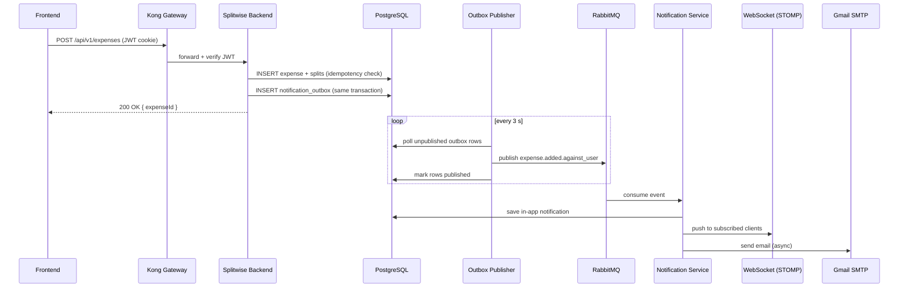
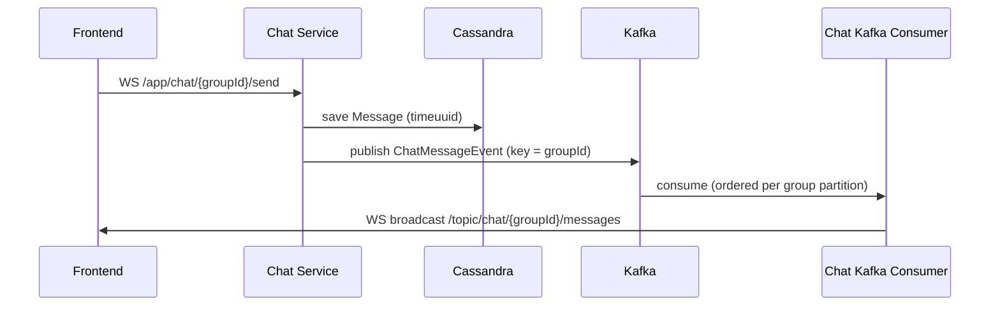
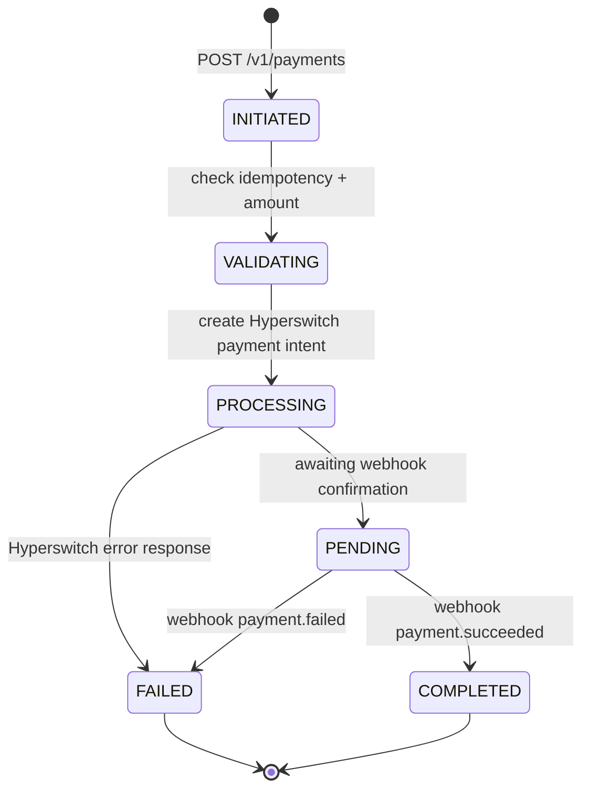

<div align="center">

# SplitMoney

**A production-grade, full-stack expense-splitting platform built on microservices**

[](https://adoptium.net)
[](https://spring.io/projects/spring-boot)
[](https://react.dev)
[](https://www.typescriptlang.org)
[](https://tailwindcss.com)
[](https://konghq.com)
[](https://kafka.apache.org)
[](https://www.postgresql.org)
[](https://redis.io)
[](https://cassandra.apache.org)
[](https://grafana.com)

[Features](#features) · [Architecture](#architecture) · [Services](#services) · [Quick Start](#quick-start) · [API Reference](#api-reference) · [Observability](#observability)

</div>

---

## Overview

SplitMoney is a **full-stack expense-sharing application** modelled on Splitwise. It demonstrates production microservices patterns — transactional outbox, idempotent payments, real-time chat, AI-powered expense parsing, document management, and a complete observability stack with metrics, logs, alerts, and dashboards.

The system is built as **seven independent Spring Boot services** behind a Kong API gateway, communicating over REST, gRPC, WebSocket, RabbitMQ, and Kafka. Every service owns its database schema, ships Flyway migrations, exposes Prometheus metrics, and sends structured JSON logs to Loki.

---

## Features

### Core Expense Management
- Create **expense groups** and invite members
- Add expenses with **three split strategies** — Equal, Exact, and Percentage
- Real-time **balance calculation** per group and across all groups
- **Idempotent expense creation** — SHA-256 request hash prevents duplicate submissions

### Payments & Settlements
- Initiate settlements via the **Hyperswitch payment gateway** (open-source Stripe alternative)
- Full **payment state machine** — `INITIATED → VALIDATING → PROCESSING → PENDING / COMPLETED / FAILED`
- Webhook-based payment confirmation with replay-attack protection
- Payment lifecycle events published to Kafka for downstream consumption

### Real-Time Chat
- **WebSocket (STOMP)** group chat per expense group
- Persistent message history in **Apache Cassandra** with cursor-based pagination
- **Online presence** — heartbeat-driven, Redis-backed, broadcast via WebSocket
- **Typing indicators** with TTL-controlled deduplication

### AI Assistant — Splity
- **Natural-language expense creation** — describe a bill in plain text; Splity parses amount, participants, and split type and creates the expense
- Powered by **Claude Haiku 4.5** or **OpenAI GPT-4o mini** — switchable via a single config property
- Conversation context persisted in Cassandra with a 30-minute TTL
- **LLM observability** via Langfuse — prompt traces, token counts, and latencies

### Document Management
- Upload receipts and documents **per expense group**
- Storage backend switchable between **local filesystem** and **AWS S3**
- Up to 10 MB per file with MIME-type validation

### Notifications
- **In-app notifications** pushed in real time via WebSocket (STOMP)
- **Email notifications** via Gmail SMTP — expense added, member joined/left group
- Configurable per-user **notification preferences** per channel
- **Exponential retry queue** — TTL dead-letter queues: 1 m → 5 m → 15 m → 60 m → DLQ
- Transactional outbox guarantees **at-least-once delivery** from Splitwise Backend to RabbitMQ

### Authentication & Security
- **Email / password registration** with OTP email verification
- **Google OAuth 2.0 / PKCE** sign-in
- RSA-2048 signed JWTs — auth service signs; all other services verify from the distributed public key
- Refresh token rotation, password history enforcement, forgot-password OTP flow
- Kong enforces JWT validation and rate-limiting on every protected route

---

## Architecture

### System Overview

```mermaid
graph TB
    Browser["Browser\nReact 18 + Vite\nlocalhost:5173"]

    subgraph GW["API Gateway"]
        Kong["Kong Gateway 3.7\n:8000 proxy  :8001 admin\nJWT auth · Rate limiting · CORS"]
    end

    subgraph Backend["Backend Services (local JVM)"]
        direction TB
        Auth["Auth Backend\n:8087  Spring Boot 4.0.2"]
        Splitwise["Splitwise Backend\n:8081  Spring Boot 3.5"]
        Payment["Payment Service\n:8086 / gRPC :9095  Spring Boot 4.0.3"]
        Notification["Notification Service\n:8083  Spring Boot 3.5"]
        Chat["Chat Service\n:8085  Spring Boot 3.5"]
        Document["Document Service\n:8084  Spring Boot 3.5"]
        AI["AI Service — Splity\n:8088  Spring Boot 3.5"]
    end

    subgraph Infra["Infrastructure (Docker)"]
        Postgres["PostgreSQL 15  :5432\n6 isolated schemas"]
        Redis["Redis 7  :6379\nSessions · Presence · OTPs"]
        Rabbit["RabbitMQ 3.13  :5672\nExpense & member events"]
        Kafka["Apache Kafka  :9092\nChat messages · Payment events"]
        Cassandra["Apache Cassandra 4  :9042\nChat messages · AI history"]
    end

    subgraph Observability["Observability (Docker)"]
        Prometheus["Prometheus  :9090"]
        Grafana["Grafana 11  :3001"]
        Loki["Loki 3  :3100"]
        Langfuse["Langfuse  :3002"]
    end

    subgraph External["External APIs"]
        Hyperswitch["Hyperswitch\nPayment Gateway"]
        Gmail["Gmail SMTP"]
        AnthropicAPI["Anthropic API\nclaude-haiku-4-5"]
    end

    Browser -- "HTTP REST + JWT cookie" --> Kong
    Browser -- "WS STOMP /ws/notifications" --> Notification
    Browser -- "WS STOMP /ws/chat" --> Chat

    Kong --> Auth
    Kong --> Splitwise
    Kong --> Notification
    Kong --> Chat
    Kong --> Document
    Kong --> AI

    Auth --- Postgres
    Auth --- Redis

    Splitwise --- Postgres
    Splitwise -- "Outbox → AMQP" --> Rabbit

    Payment --- Postgres
    Payment -- "Kafka events" --> Kafka
    Payment --> Hyperswitch

    Notification --- Postgres
    Notification --- Redis
    Notification -- "Consumes events" --> Rabbit
    Notification --> Gmail

    Chat -- "Kafka publish/consume" --> Kafka
    Chat --- Cassandra
    Chat --- Redis

    Document --- Postgres

    AI --- Cassandra
    AI --- Postgres
    AI --- Redis
    AI --> AnthropicAPI

    Prometheus -- "scrape /actuator/prometheus" --> Auth
    Prometheus -- "scrape /actuator/prometheus" --> Splitwise
    Prometheus -- "scrape /actuator/prometheus" --> Payment
    Prometheus -- "scrape /actuator/prometheus" --> Notification
    Prometheus -- "scrape /actuator/prometheus" --> Chat
    Prometheus -- "scrape /actuator/prometheus" --> Document
    Prometheus -- "scrape /actuator/prometheus" --> AI
    Grafana --- Prometheus
    Grafana --- Loki
    AI --- Langfuse
```



---

### Expense Event Flow

When a user adds an expense, the platform guarantees exactly-once in-app and email delivery using the **Transactional Outbox pattern**.



---

### Chat Message Flow

Chat messages are written to Cassandra first for durability, then fanned out to subscribers via Kafka to decouple ingestion from broadcast.



---

### Payment State Machine



---

## Services

| Service | Port | Stack | Database | Responsibility |
|---------|------|-------|----------|----------------|
| **Auth Backend** | `8087` | Spring Boot 4.0.2 · Java 21 | PostgreSQL `authdb` | Registration, login, Google OAuth, JWT signing, OTP, password reset |
| **Splitwise Backend** | `8081` | Spring Boot 3.5.10 · Java 21 | PostgreSQL `splitmoney` | Groups, expenses (Equal / Exact / %), balances, outbox publisher |
| **Payment Service** | `8086` · gRPC `9095` | Spring Boot 4.0.3 · Java 21 | PostgreSQL `paymentdb` | Payment state machine, Hyperswitch integration, Kafka events |
| **Notification Service** | `8083` | Spring Boot 3.5.10 · Java 21 | PostgreSQL `notificationdb` | In-app + email notifications, WebSocket STOMP push, retry queues |
| **Chat Service** | `8085` | Spring Boot 3.5.10 · Java 21 | Cassandra `chatdb` · Redis | Real-time group chat, message history, presence, typing indicators |
| **Document Service** | `8084` | Spring Boot 3.5.10 · Java 21 | PostgreSQL `documentdb` | File upload/download per group, local / S3 storage |
| **AI Service (Splity)** | `8088` | Spring Boot 3.5.10 · Java 21 | Cassandra `splitydb` · PostgreSQL `aidb` | NL expense parsing via Claude / OpenAI, conversation memory, Langfuse tracing |
| **Frontend** | `5173` | React 18 · Vite · Tailwind CSS · TypeScript | — | SPA: groups, expenses, chat, documents, analytics, settings |
| **Kong Gateway** | `8000` | Kong 3.7 (declarative YAML) | PostgreSQL `kong` | JWT auth, rate limiting, CORS, Prometheus plugin |

---

## Tech Stack

### Backend

| Category | Technology |
|----------|-----------|
| Runtime | Java 21, Spring Boot 3.5 / 4.0 |
| API Gateway | Kong 3.7 (declarative YAML config) |
| Relational DB | PostgreSQL 15 — per-service schemas, Flyway migrations |
| Wide-column DB | Apache Cassandra 4 — chat messages, AI conversation history |
| Cache / Presence | Redis 7 — sessions, OTPs, online presence, typing TTL |
| Message Bus | RabbitMQ 3.13 — expense events over AMQP (Outbox pattern) |
| Streaming | Apache Kafka — chat messages, payment lifecycle events |
| Payments | Hyperswitch (open-source Stripe alternative) |
| AI / LLM | Anthropic Claude Haiku 4.5 · OpenAI GPT-4o mini (switchable) |
| LLM Observability | Langfuse — prompt traces, token usage, latencies |
| Real-time | WebSocket + STOMP (Spring WebSocket) |
| Security | RSA-2048 JWT · Google OAuth 2.0 PKCE · BCrypt |

### Frontend

| Category | Technology |
|----------|-----------|
| Framework | React 18, TypeScript 5 |
| Build Tool | Vite 5 |
| Styling | Tailwind CSS 3 |
| State | React Context API |
| Real-time | STOMP.js over WebSocket |
| Charts | Recharts |

### Observability

| Category | Technology |
|----------|-----------|
| Metrics | Prometheus v2.54.1 — scrapes all 7 services + infra exporters |
| Dashboards | Grafana 11.2 — 9 provisioned dashboards |
| Logs | Loki 3 + Loki4j logback appender — structured JSON from all services |
| Alerting | Prometheus alert rules — SLO breaches, error spikes, Kafka consumer lag |
| LLM Traces | Langfuse — full prompt/completion traces for AI service |

### Design Patterns

| Pattern | Applied In |
|---------|-----------|
| **Transactional Outbox** | Splitwise Backend → RabbitMQ — guarantees at-least-once delivery |
| **Idempotency** | Expense creation (SHA-256 hash, 24 h TTL), Payment creation |
| **State Machine** | Payment Service — explicit state transitions, persisted to DB |
| **Strategy** | `ComputeShareStrategy` — Equal, Exact, Percentage split algorithms |
| **Factory** | `ProcessorFactory`, `ValidatorFactory`, `ComputeShareFactory` |
| **Dead Letter Queue** | Notification retry — 1 m → 5 m → 15 m → 60 m → DLQ |

---

## Quick Start

### Prerequisites

| Tool | Min Version | Install |
|------|-------------|---------|
| Java JDK | 21 | `brew install --cask temurin@21` |
| Maven | 3.9+ | `brew install maven` |
| Node.js | 18+ | `brew install node` |
| Docker Desktop | latest | [docker.com](https://www.docker.com/products/docker-desktop) |
| openssl | any | Pre-installed on macOS / Linux |

### 1 — Configure environment

```bash
cp .env.example .env
# Fill in: DB passwords, Google OAuth credentials, Gmail App Password
bash scripts/validate-env.sh   # verify all required variables are set
```

See [`SETUP.md`](SETUP.md) for step-by-step instructions on obtaining each credential.

### 2 — Generate JWT keys

```bash
mkdir -p AuthNAndAuthZ/auth-backend/keys

openssl genpkey -algorithm RSA \
  -out AuthNAndAuthZ/auth-backend/keys/jwt-private.pem \
  -pkeyopt rsa_keygen_bits:2048

openssl rsa -pubout \
  -in  AuthNAndAuthZ/auth-backend/keys/jwt-private.pem \
  -out AuthNAndAuthZ/auth-backend/keys/jwt-public.pem

# Distribute the public key to verifying services
cp AuthNAndAuthZ/auth-backend/keys/jwt-public.pem splitewise-backend/src/main/resources/keys/
cp AuthNAndAuthZ/auth-backend/keys/jwt-public.pem notification/src/main/resources/keys/
```

After generating, paste the public key into `kong/kong.yml` under `consumers[0].jwt_secrets[0].rsa_public_key`.

### 3 — Bootstrap database schemas (once)

```bash
psql -U postgres -d postgres -f scripts/00_create_schemas.sql
```

This creates six isolated schemas: `authdb`, `splitmoney`, `paymentdb`, `notificationdb`, `aidb`, `documentdb`. Each service's Flyway migrations create tables on first startup.

### 4 — Start infrastructure

```bash
set -a && source .env && set +a

# First run — initialise Kong DB and import declarative config
docker compose --profile init up -d

# Subsequent runs
docker compose up -d

# Verify all containers are healthy
docker compose ps
```

### 5 — Start backend services

Start in order: Auth Backend → Splitwise Backend / Notification → remaining services.

```bash
# Auth Backend
cd AuthNAndAuthZ/auth-backend && set -a && source ../../.env && set +a && ./mvnw spring-boot:run

# Splitwise Backend
cd splitewise-backend && set -a && source ../.env && set +a && ./mvnw spring-boot:run

# Notification Service
cd notification && set -a && source ../.env && set +a \
  && export DB_URL=$NOTIFICATION_DB_URL DB_USERNAME=$NOTIFICATION_DB_USERNAME DB_PASSWORD=$NOTIFICATION_DB_PASSWORD \
  && ./mvnw spring-boot:run

# Chat Service
cd chat-service && set -a && source ../.env && set +a && ./mvnw spring-boot:run

# Document Service
cd document-service && set -a && source ../.env && set +a && ./mvnw spring-boot:run

# AI Service (Splity)
cd ai-service && set -a && source ../.env && set +a && ./mvnw spring-boot:run

# Payment Service
cd payment-service && set -a && source ../.env && set +a && ./mvnw spring-boot:run
```

Verify each service: `curl http://localhost:<port>/actuator/health` → `{"status":"UP"}`

### 6 — Start frontend

```bash
cd frontend-splitmoney
npm install
npm run dev
```

Open [http://localhost:5173](http://localhost:5173).

---

## Service URLs

| Service | URL | Credentials |
|---------|-----|-------------|
| Frontend | http://localhost:5173 | — |
| API Gateway (Kong) | http://localhost:8000 | — |
| Kong Admin API | http://localhost:8001 | — |
| Konga (Kong UI) | http://localhost:1337 | — |
| Auth Backend (direct) | http://localhost:8087 | — |
| Splitwise Backend (direct) | http://localhost:8081 | — |
| Payment Service (direct) | http://localhost:8086 | — |
| Notification Service (direct) | http://localhost:8083 | — |
| Chat Service (direct) | http://localhost:8085 | — |
| Document Service (direct) | http://localhost:8084 | — |
| AI Service (direct) | http://localhost:8088 | — |
| RabbitMQ Management | http://localhost:15672 | `guest` / `guest` (dev) |
| Prometheus | http://localhost:9090 | — |
| Grafana | http://localhost:3001 | `admin` / `$GRAFANA_ADMIN_PASSWORD` |
| Langfuse | http://localhost:3002 | — |

> Direct service URLs bypass Kong — for local debugging only. All production traffic must go through Kong on `:8000`.

---

## API Reference

All requests below are routed through Kong (`localhost:8000`). Protected routes require a `jwt` cookie set by the auth service on login.

### Authentication — `/api/auth/v1/`

| Method | Path | Auth | Description |
|--------|------|------|-------------|
| `POST` | `/register` | Public | Register with email + password; triggers OTP email |
| `POST` | `/verify-registration-otp` | Public | Verify OTP to activate account |
| `POST` | `/login` | Public | Email/password login — sets `jwt` + `refresh_token` cookies |
| `POST` | `/login/google` | Public | Google OAuth 2.0 PKCE sign-in |
| `POST` | `/forgot-password` | Public | Send password-reset OTP |
| `POST` | `/reset-password` | Public | Confirm OTP and set new password |
| `POST` | `/refresh` | JWT | Rotate refresh token |

### Groups & Expenses — `/api/splitwise/v1/` · `/api/v1/`

| Method | Path | Auth | Description |
|--------|------|------|-------------|
| `POST` | `/api/splitwise/v1/create-group` | JWT | Create an expense group |
| `POST` | `/api/splitwise/v1/user-groups` | JWT | List groups for the current user |
| `POST` | `/api/splitwise/v1/group-details` | JWT | Fetch group metadata |
| `GET`  | `/api/splitwise/v1/groups/{id}/members` | JWT | List group members |
| `POST` | `/api/splitwise/v1/user-balances` | JWT | Get balances across all groups |
| `POST` | `/api/v1/expenses` | JWT | Add an expense (idempotency key required) |
| `POST` | `/api/expenses/settle/initiate` | JWT | Initiate a settlement payment |

### Chat — `/api/chat/v1/`

| Method | Path | Auth | Description |
|--------|------|------|-------------|
| `GET`  | `/groups/{id}/messages` | JWT | Message history (cursor-based pagination) |
| `GET`  | `/groups/{id}/presence` | JWT | Online members list |
| `GET`  | `/groups/{id}/unread-cursor` | JWT | Last-seen timestamp |
| `POST` | `/groups/{id}/mark-read` | JWT | Update last-seen to now |
| WS | `/app/chat/{id}/send` | WS session | Send a chat message |
| WS | `/app/chat/{id}/typing` | WS session | Broadcast typing indicator |
| WS | `/app/chat/{id}/heartbeat` | WS session | Presence heartbeat |

### Documents — `/api/docs/v1/`

| Method | Path | Auth | Description |
|--------|------|------|-------------|
| `POST`   | `/groups/{id}/upload` | JWT | Upload a document (multipart, max 10 MB) |
| `GET`    | `/groups/{id}/documents` | JWT | List documents for a group |
| `GET`    | `/files/{documentId}` | JWT | Download a document |
| `DELETE` | `/documents/{documentId}` | JWT | Delete a document |

### AI — Splity — `/api/ai/v1/groups/{groupId}/splity/`

| Method | Path | Auth | Description |
|--------|------|------|-------------|
| `POST` | `/chat` | JWT | Send a message; returns AI reply + optional parsed expense |
| `GET`  | `/messages` | JWT | Conversation history (last 30 min) |

### Notifications — `/api/notifications`

| Method | Path | Auth | Description |
|--------|------|------|-------------|
| `GET`  | `/` | JWT | Paginated notification list |
| `POST` | `/{id}/read` | JWT | Mark notification read |
| `POST` | `/{id}/click` | JWT | Mark notification clicked |
| `GET` / `POST` | `/preferences` | JWT | Get / update notification preferences |
| WS | `/ws/notifications` | JWT | STOMP push for new notifications |

---

## Observability

### Grafana Dashboards

| Dashboard | Key Signals |
|-----------|-------------|
| **Infrastructure Overview** | PostgreSQL connections, Redis hit rate, RabbitMQ queue depth, Kafka consumer lag |
| **JVM Overview** | Heap usage, GC pause time, thread counts (all 7 services) |
| **Auth Backend** | Request rate, JWT issue rate, OTP events, login error rate |
| **Splitwise Backend** | Expense creation rate, balance query latency, outbox queue depth |
| **Payment Service** | Payment funnel by state, Hyperswitch latency, webhook throughput |
| **Notification Service** | Delivery rate, retry queue depths by level, email send latency |
| **Chat Service** | Message throughput, E2E latency P50/P95, presence transitions, Cassandra latency |
| **Document Service** | Upload/download rate, storage bytes used, MIME rejection rate |
| **Kong** | Requests/sec per route, latency percentiles, upstream 4xx/5xx rate |

### Log Aggregation

All services ship structured JSON logs to **Loki** via the `loki4j-logback-appender`. Logs are queryable in Grafana Explore with LogQL:

```logql
{app="chat-service"} | json | level="ERROR"
{app="payment-service"} | json | line_format "{{.message}}"
{app=~".+"} | json | level=~"ERROR|WARN" | rate[5m]
```

### LLM Observability (Langfuse)

The AI service sends every Splity conversation turn to Langfuse, including the full prompt, model response, token counts, and request latency. Browse traces at http://localhost:3002.

### Alert Rules

Prometheus fires alerts for:
- HTTP error rate > 5% for any service
- JVM heap usage > 85%
- Kafka consumer lag > 1000 messages
- RabbitMQ queue depth > 500
- Payment processing failures

---

## Project Structure

```
.
├── AuthNAndAuthZ/
│   └── auth-backend/               # Auth service (Spring Boot 4.0.2)
├── splitewise-backend/             # Expense / groups service (Spring Boot 3.5)
├── payment-service/                # Payment state machine + Hyperswitch (Spring Boot 4.0.3)
├── notification/                   # Email + in-app notifications (Spring Boot 3.5)
├── chat-service/                   # Real-time chat + presence (Spring Boot 3.5)
├── document-service/               # File upload / download (Spring Boot 3.5)
├── ai-service/                     # Splity AI assistant (Spring Boot 3.5)
├── frontend-splitmoney/            # React 18 + Vite + Tailwind SPA
├── kong/                           # Kong declarative config (kong.yml)
├── config/
│   ├── grafana/                    # Grafana provisioning — 9 dashboards
│   ├── loki/                       # Loki 3 config
│   ├── prometheus/                 # Prometheus scrape targets + alert rules
│   └── rabbitmq/                   # RabbitMQ topology definitions
├── scripts/
│   ├── validate-env.sh             # Pre-flight .env completeness checker
│   └── 00_create_schemas.sql       # One-time DB schema bootstrap
├── docker-compose.yml              # Infrastructure containers
├── .env.example                    # Environment variable template
├── SETUP.md                        # Full developer setup guide
├── RUNBOOK.md                      # Operational runbook
└── FEATURE.md                      # Feature backlog, security issues (P0/P1), tech debt
```

---

## Documentation

| Document | Description |
|----------|-------------|
| [`SETUP.md`](SETUP.md) | Full developer setup — credentials, DB init, Kong config, IDE run configs, troubleshooting |
| [`RUNBOOK.md`](RUNBOOK.md) | Operational runbook — incident response, scaling, backup/restore |
| [`FEATURE.md`](FEATURE.md) | Feature backlog, known security issues (P0/P1), tech debt, infrastructure gaps |

---

<div align="center">

Built with Java 21 · Spring Boot · React · Kafka · Cassandra · Redis · Kong · Grafana

</div>
