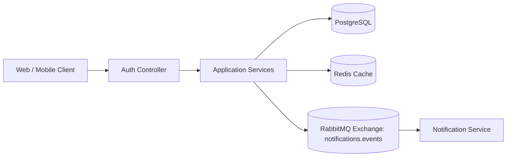
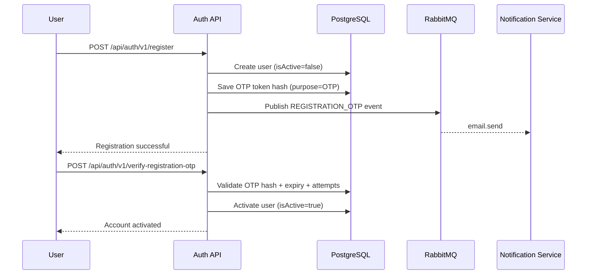

# Auth Backend - Registration OTP + JWT Authentication

<p align="center">
  <b>Production-style Spring Boot Auth Service</b><br/>
  JWT login, registration with OTP verification, async notification publishing via RabbitMQ,
  Redis + local caching, and observability endpoints.
</p>

<p align="center">
  
  
  
  
  
</p>

---

## 1) What This Project Solves

This backend provides the authentication core for an app:

- User registration with secure password storage.
- OTP-based account activation flow (email channel).
- Login blocked until OTP verification is successful.
- Resend OTP with cooldown and attempt throttling.
- JWT-based stateless authentication.
- Async event publishing to Notification service via RabbitMQ.

---

## 2) High-Level Architecture



### Core modules

- **Controller Layer**: request handling and response shaping.
- **Validator + Processor Factories**: route each API type to its validator/service.
- **Service Layer**: business rules (register, login, verify OTP, resend OTP).
- **Security Layer**: JWT filters/strategy, account state checks.
- **Persistence Layer**: JPA repositories and entities.
- **Messaging Layer**: RabbitTemplate publisher with correlation header support.

---

## 3) Registration and OTP Flow



### Security behavior

- New users are created as `isActive=false`.
- Login checks account state and rejects inactive users.
- OTP verification activates the account.
- Invalid OTP attempts are counted.
- After max attempts, account enters cooldown (`lockedUntil`).

---

## 4) API Endpoints

Base path: `/api/auth`

| Method | Endpoint | Purpose | Auth |
|---|---|---|---|
| POST | `/v1/register` | Register user and trigger OTP email event | Public |
| POST | `/v1/verify-registration-otp` | Verify OTP and activate account | Public |
| POST | `/v1/resend-registration-otp` | Resend OTP with resend cooldown checks | Public |
| POST | `/v1/login` | Login and issue JWT cookies | Public |
| POST | `/v1/logout` | Clear auth cookies | Public |
| POST | `/v1/forgot-password` | Placeholder | Public |
| POST | `/v1/reset-password` | Placeholder | Public |

### Common response envelope

```json
{
  "requestId": "req-123",
  "success": true,
  "responseCode": "200",
  "responseMessage": "OK",
  "timestamp": "2026-02-19T10:00:00Z",
  "data": {}
}
```

---

## 5) Notification Event Contract (Published by Auth Service)

- **Exchange**: `notifications.events`
- **Routing key**: `email.send`
- **Optional header**: `X-Correlation-Id` (derived from request id)

```json
{
  "notificationId": "uuid",
  "userId": "uuid",
  "channel": "EMAIL",
  "eventType": "REGISTRATION_OTP",
  "idempotencyKey": "auth-register-<requestId>",
  "attempt": 1,
  "createdAt": "2026-02-19T10:00:00Z",
  "payload": {
    "email": "user@example.com",
    "otp": "834921",
    "expiryMinutes": 10
  }
}
```

---

## 6) Project Structure

```text
src/main/java/com/javaproject/application
├── config/                  # Security, Redis, RabbitMQ, Jackson
├── controller/              # REST controllers
├── dto/                     # Request/response contracts
├── enums/                   # API + notification enums
├── exception/               # Global exception handling
├── filter/                  # Correlation and request logging
├── model/                   # JPA entities
├── repository/              # Spring Data repositories
├── security/                # JWT and user-details strategy
├── service/impl/            # Business logic services
├── service/factory/         # Processor selection
└── validator/               # Request validators and factory
```

---

## 7) Prerequisites

- Java 21
- Maven (or use `./mvnw`)
- PostgreSQL
- Redis
- RabbitMQ

---

## 8) Local Setup

### 8.1 Configure environment variables (recommended)

```bash
export AUTH_DB_URL="jdbc:postgresql://localhost:5432/postgres?currentSchema=authdb"
export AUTH_DB_USERNAME="postgres"
export AUTH_DB_PASSWORD="your_password"

export RABBITMQ_HOST="localhost"
export RABBITMQ_PORT="5672"
export RABBITMQ_USERNAME="guest"
export RABBITMQ_PASSWORD="guest"
```

### 8.2 Run dependencies

- Start PostgreSQL
- Start Redis
- Start RabbitMQ

### 8.3 Build and run

```bash
./mvnw clean compile
./mvnw spring-boot:run
```

---

## 9) Important RabbitMQ Note (Very Common Integration Issue)

RabbitMQ exchange type must match exactly with what the app declares.

- App config uses: **DirectExchange** for `notifications.events`
- If broker already has same exchange as `topic`, startup/publish will fail with:
  `PRECONDITION_FAILED - inequivalent arg 'type'`

Check and fix with:

```bash
rabbitmqadmin list exchanges name type | grep notifications.events
```

If needed:

```bash
rabbitmqadmin delete exchange name=notifications.events
rabbitmqadmin declare exchange name=notifications.events type=direct durable=true
```

---

## 10) OTP DB Constraint Note

Current OTP persistence uses `purpose='OTP'`.

If you want to support `REGISTERATION_OTP` in DB constraint, run:

```sql
ALTER TABLE authdb.otp_tokens
DROP CONSTRAINT IF EXISTS chk_otp_tokens_purpose;

ALTER TABLE authdb.otp_tokens
ADD CONSTRAINT chk_otp_tokens_purpose
CHECK (purpose IN ('OTP', 'PASSWORD_RESET', 'REGISTERATION_OTP'));
```

---

## 11) Observability

- Health: `/actuator/health`
- Info: `/actuator/info`
- Prometheus: `/actuator/prometheus`
- Request correlation header: `X-Request-Id`

---


