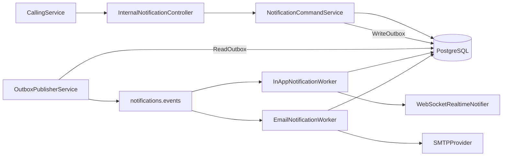
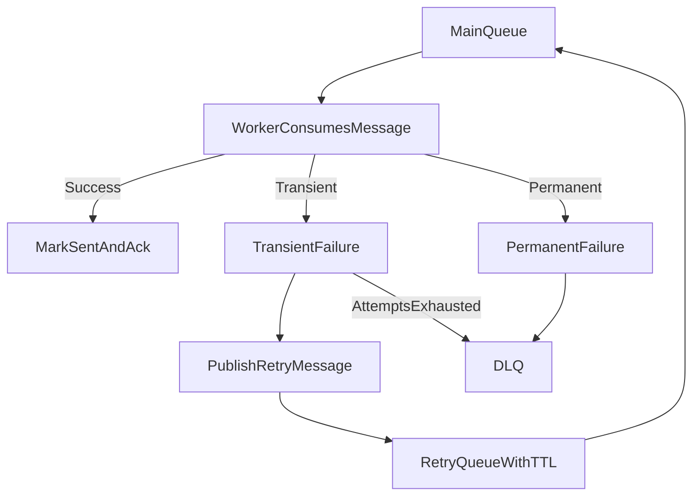

# Notification Service

Event-driven notification service for sending **in-app** and **email** notifications with strong delivery guarantees.

Built with Java 21, Spring Boot, RabbitMQ, PostgreSQL, Redis, and Flyway.

---

## Highlights

- Transactional outbox for reliable publish
- Async workers with retries and DLQ
- Feature-flag rollout (including email canary)
- DB-backed email templates with Redis cache
- WebSocket push for real-time in-app notifications
- Prometheus metrics and JSON structured logs

---

## Tech Stack

- Java 21
- Spring Boot 3.5
- PostgreSQL + Flyway
- RabbitMQ
- Redis
- Micrometer + Prometheus
- Maven

---

## Architecture



### Delivery and Retry Flow



---

## Project Structure

```text
src/main/java/com/splitwise/notification
  config/          # Rabbit, cache, websocket, properties
  domain/          # Enums and domain primitives
  dto/             # API request/response contracts
  exception/       # Domain/application exceptions
  logging/         # MDC keys and scope helpers
  messaging/       # Internal message contracts and retry publisher
  observability/   # Metrics
  persistence/     # JPA entities and repositories
  service/         # Query/command orchestration and workers support
  web/             # REST controllers and global exception handling
  worker/          # Rabbit consumers (in-app, email)
```

---

## APIs

### Internal producer API

- `POST /internal/notifications/events`
  - Creates notification records, channel state, and outbox events
  - Returns `202 Accepted`
  - Optional header: `X-Idempotency-Key`

Sample request:

```json
{
  "userId": "aaaaaaaa-aaaa-aaaa-aaaa-aaaaaaaaaaaa",
  "eventType": "REGISTRATION_OTP",
  "title": "Verify your account",
  "body": "Use the OTP to complete registration",
  "payload": {
    "email": "user@example.com",
    "otp": "834921",
    "expiryMinutes": 10
  }
}
```

### User API

- `GET /notifications`
- `POST /notifications/{id}/read`
- `POST /notifications/read-all`
- `POST /notifications/{id}/click`
- `GET /notifications/unread-count`

### Template Admin API

- `PUT /internal/email-templates`
- `POST /internal/email-templates/{eventType}/activate`
- `POST /internal/email-templates/{eventType}/deactivate`
- `POST /internal/email-templates/cache/evict-all`

---

## RabbitMQ Contracts

Exchange: `notifications.events`

Routing keys:
- `inapp.created`
- `email.send`

Internal worker message format (`NotificationMessage`):

```json
{
  "notificationId": "6d1c57f0-f72d-4636-a5bf-4f63df4b6f44",
  "userId": "aaaaaaaa-aaaa-aaaa-aaaa-aaaaaaaaaaaa",
  "channel": "EMAIL",
  "eventType": "REGISTRATION_OTP",
  "idempotencyKey": "req-12345",
  "attempt": 1,
  "createdAt": "2026-02-19T10:00:00Z",
  "payload": {
    "email": "user@example.com",
    "otp": "834921",
    "expiryMinutes": 10
  }
}
```

---

## Configuration

Key environment variables:

- App: `SERVER_PORT`
- DB: `DB_URL`, `DB_USERNAME`, `DB_PASSWORD`, `DB_SCHEMA`
- RabbitMQ: `RABBITMQ_HOST`, `RABBITMQ_PORT`, `RABBITMQ_USERNAME`, `RABBITMQ_PASSWORD`
- Email: `EMAIL_PROVIDER`, `MAIL_HOST`, `MAIL_PORT`, `MAIL_USERNAME`, `MAIL_PASSWORD`, `MAIL_FROM`
- Redis: `REDIS_HOST`, `REDIS_PORT`, `REDIS_PASSWORD`
- Logging: `LOG_DIR`, `LOG_LEVEL`, `LOG_MAX_FILE_SIZE`, `LOG_MAX_HISTORY`, `LOG_TOTAL_SIZE_CAP`

### Flyway and schema

The service is configured to run migrations on schema `authdb` by default with baseline support for existing non-empty schemas.

---

## Rollout Strategy

Feature flags:

- `notification.features.in-app-enabled`
- `notification.features.email-enabled`
- `notification.features.email-canary-percent`

Suggested progression:

1. In-app only
2. Email canary (5%)
3. Ramp to 25% -> 50% -> 100%

Rollback:

- Set `notification.features.email-enabled=false`
- Continue in-app delivery
- Inspect and replay DLQ once fixed

---

## Observability

Prometheus endpoint:

- `/actuator/prometheus`

Core metrics:

- `notification.outbox.published_total`
- `notification.outbox.failed_total`
- `notification.worker.processed_total{channel="in_app|email"}`
- `notification.worker.retried_total{channel="email"}`
- `notification.worker.failed_total{channel="email"}`
- `notification.worker.dlq.published_total{channel="email"}`

Recommended alerts:

- Main queue backlog spike
- DLQ growth over time
- Outbox publish failures
- Email failure ratio threshold breach

---

## Local Run

### 1) Start infrastructure

```bash
docker compose up -d rabbitmq
```

### 2) Run service

```bash
mvn spring-boot:run
```

### 3) Full stack via Docker

```bash
docker compose up -d --build
```

---

## Build and Test

```bash
mvn clean test
mvn -DskipTests compile
```

---

## Email Template Notes

- Templates are stored in `email_template` table
- Placeholders use `{{key}}` syntax
- Active template is resolved by `event_type` (with fallback)
- Redis cache key space: `email-template-by-event`

Seeded events include:

- `REGISTRATION_OTP`
- `EMAIL_VERIFICATION`
- `PASSWORD_RESET`
- `GENERIC`

---

## Production Notes

- Use Google App Password (not Gmail login password) when `EMAIL_PROVIDER=gmail`
- Keep `X-Idempotency-Key` stable per source event
- Avoid publishing external service events directly to internal worker queues unless contract is strictly controlled
  {"userId": "2f97b6e8-2039-4aad-b250-21455573f01f", "attempt": 1, "channel": "IN_APP", "payload": {"otp": "659497", "email": "vedangmoon@gmail.com", "mobile": "8553193239", "expiryMinutes": 10}, "createdAt": "2026-04-26T09:29:28.190969Z", "eventType": "REGISTRATION_OTP", "idempotencyKey": "auth-register-req-64718a92-1736-40d2-b230-48d1f4df91f7:ec980e8e-6b41-435f-b49d-6e211f3725c2:IN_APP", "notificationId": "ec980e8e-6b41-435f-b49d-6e211f3725c2"}
