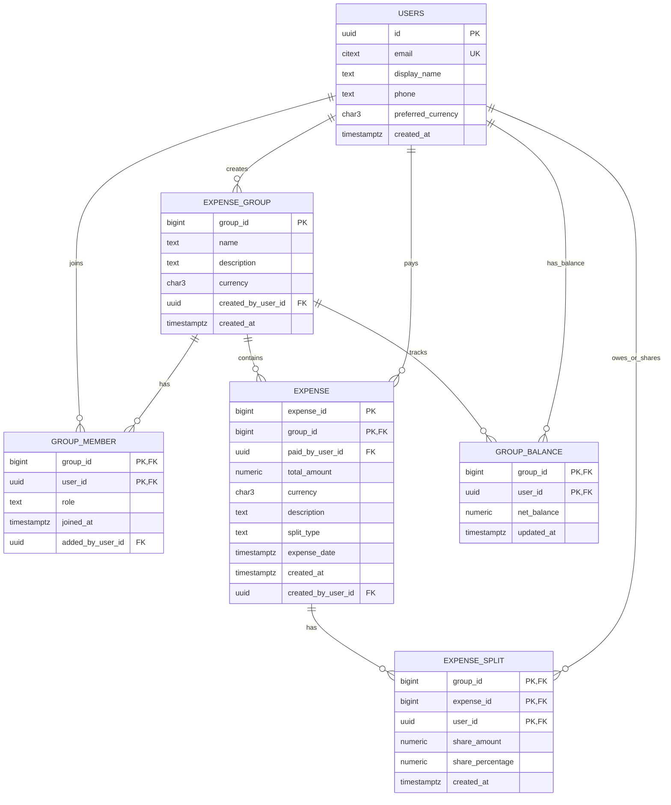

# Splitwise Microservice - Database Design

## 1) Database Type Choice

**Chosen: SQL (PostgreSQL 16+)**

Why SQL over NoSQL for this service:

- Strong consistency is mandatory for balances and financial correctness.
- Expense creation touches multiple rows/tables and needs ACID transactions.
- Referential integrity (users, groups, members, expenses, splits) is core domain behavior.
- Read patterns are structured and index-friendly (group history, balances, settlements input).
- PostgreSQL gives partitioning, constraints, and rich indexing while keeping operational simplicity.

---

## 2) ER Diagram

---

## 3) Core Modeling Notes

- `GROUP_BALANCE.net_balance` is the strongly-consistent source for current balances.
  - Positive means user should receive.
  - Negative means user owes.
- On `Add Expense`, write `expense`, `expense_split`, and update `group_balance` **in one transaction**.
- Simplified settlements are computed from `group_balance` (greedy min-transactions algorithm in app/service layer).
- Expense history reads from `expense` (+ optional join to splits when details are needed).

---

## 4) Constraints Strategy

Hard constraints in DB:

- Email uniqueness (`users.email`, already present in auth service).
- Membership uniqueness (`group_member(group_id, user_id)`).
- Monetary amount positivity checks (`total_amount > 0`, `share_amount >= 0`).
- Valid split type enum (`EQUAL`, `EXACT`, `PERCENTAGE`).
- Foreign keys for ownership and membership graph.

Business constraints enforced with transaction logic (service + SQL checks):

- `EXACT`: sum(split amounts) == total amount.
- `PERCENTAGE`: sum(percentages) == 100 and derived amount sum == total.
- Payer/participants must be members of group.
- Group member limit = 1000 (enforced with trigger in SQL script).

---

## 5) Index Plan

Primary query patterns and indexes:

- Group expense history: `expense(group_id, expense_date desc, expense_id desc)`.
- User-centric history within group: `expense(group_id, paid_by_user_id, expense_date desc)`.
- Split lookup for one expense: `expense_split(group_id, expense_id)`.
- Balances for a group: `group_balance(group_id)` + PK.
- Membership checks: `group_member(group_id, user_id)` PK.
- Idempotency replay: `idempotency_key(actor_user_id, endpoint, idem_key)` unique.

---

## 6) Partition Strategy (Large Tables)

Chosen large tables:

- `expense` (highest write/read volume)
- `expense_split` (multiple rows per expense)
- `group_balance` (hot updates per expense create)
- `idempotency_key` (large append + TTL cleanup)

Partition approach:

- `expense`, `expense_split`, `group_balance`: **HASH partition by `group_id`** into 16 partitions.
  - Group-scoped reads prune to one partition.
  - Writes spread across partitions to reduce hot pages and index contention.
- `idempotency_key`: **RANGE partition by `created_at` (monthly)**.
  - Fast retention (drop old partitions).
  - Better vacuum behavior for TTL-like data.

---

## 7) Operational Notes

- Use `READ COMMITTED` with row-level locking where needed; escalate to `SERIALIZABLE` only for specific edge workflows.
- Keep all financial writes in explicit transactions.
- Monitor:
  - lock waits on `group_balance`
  - partition skew by group hash
  - slow queries on expense history endpoints
- Archive or purge old idempotency partitions beyond retention window.

---

## 8) Existing Users Table Integration

`users` is owned by the authentication service and reused by Splitwise via FK (`users.id`).

Splitwise requires profile fields for UX/defaults, so migration includes:

- `display_name` (nullable at DB level, required by API/service for onboarding)
- `phone` (optional)
- `preferred_currency` (default `INR`)

## 9) Scripts

Executable schema and partition scripts are in:

- `database/postgres_schema.sql`
