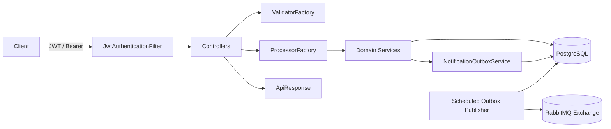
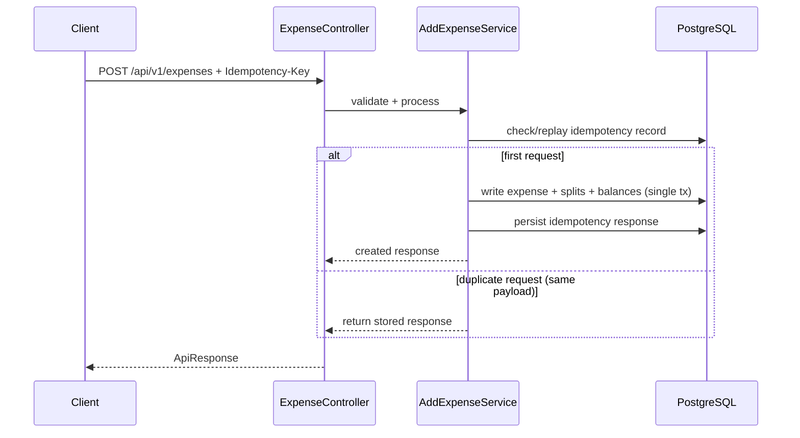
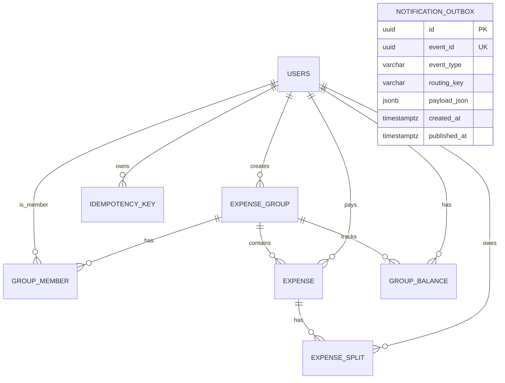

# Splitwise Backend Service

Spring Boot backend for group expense sharing, balance tracking, and event-driven notifications using an outbox publisher pattern.

## Table of Contents

- [Overview](#overview)
- [Architecture](#architecture)
- [Data Model](#data-model)
- [Tech Stack](#tech-stack)
- [Project Structure](#project-structure)
- [API Surface](#api-surface)
- [Getting Started](#getting-started)
- [Configuration](#configuration)
- [Observability](#observability)
- [Testing](#testing)
- [Roadmap](#roadmap)
- [Contributing](#contributing)

## Overview

This service manages shared expenses inside groups:

- Create groups and manage group members
- Add expenses with split strategies (`EQUAL`, `EXACT`, `PERCENTAGE`)
- Fetch user groups, group details, and per-user balances
- Publish member-change notifications asynchronously through RabbitMQ
- Protect write operations with idempotency support (`Idempotency-Key`)

## Architecture



### Add Expense Flow (High Level)



## Data Model



For full SQL schema, see `database/postgres_schema.sql`.

## Tech Stack

- Java 21
- Spring Boot 3.5
- Spring Web + Validation + Data JPA
- PostgreSQL
- RabbitMQ
- Micrometer + Prometheus registry
- Maven Wrapper (`./mvnw`)

## Project Structure

```text
src/main/java/com/javaproject/splitewise/
  controller/      # REST controllers
  service/         # processors and business services
  repository/      # Spring Data repositories
  model/           # JPA entities
  security/        # JWT validation filter/service
  config/          # RabbitMQ + properties wiring
src/main/resources/
  application.yaml
  schema.sql       # outbox table bootstrap
database/
  postgres_schema.sql
DesignDocs/
  APIContracts.md
  DBDesign.md
```

## API Surface

### Group and Membership APIs

- `POST /api/splitwise/v1/create-group`
- `PUT /api/splitwise/v1/add-member`
- `DELETE /api/splitwise/v1/remove-member`
- `POST /api/splitwise/v1/group-details`
- `POST /api/splitwise/v1/user-groups`
- `POST /api/splitwise/v1/user-balances`

### Expense API

- `POST /api/v1/expenses` (supports `Idempotency-Key` header)

### Auth Behavior

Protected paths:

- `/api/splitwise/**`
- `/api/v1/expenses`

Token sources:

- `access_token` cookie, or
- `Authorization: Bearer <token>`

## Getting Started

### Prerequisites

- JDK 21+
- PostgreSQL 14+ (or compatible)
- RabbitMQ 3.x

### 1) Clone and run locally

```bash
git clone <your-repo-url>
cd splitewise-backend
./mvnw spring-boot:run
```

### 2) Build jar

```bash
./mvnw clean package
java -jar target/*.jar
```

### 3) Run with Docker

```bash
docker build -t splitewise-backend .
docker run --rm -p 8081:8081 splitewise-backend
```

## Configuration

Environment variables used by `application.yaml`:

| Variable | Default | Description |
|---|---|---|
| `SPLITWISE_DB_URL` | `jdbc:postgresql://localhost:5432/postgres?currentSchema=authdb` | JDBC URL |
| `SPLITWISE_DB_USERNAME` | `postgres` | DB username |
| `SPLITWISE_DB_PASSWORD` | (empty) | DB password |
| `RABBITMQ_HOST` | `localhost` | RabbitMQ host |
| `RABBITMQ_PORT` | `5672` | RabbitMQ port |
| `RABBITMQ_USERNAME` | `guest` | RabbitMQ username |
| `RABBITMQ_PASSWORD` | `guest` | RabbitMQ password |
| `NOTIFICATION_EXCHANGE` | `splitwise.events` | Publish exchange |
| `NOTIFICATION_ROUTING_KEY` | `group.member.added` | Default routing key |
| `NOTIFICATION_OUTBOX_FIXED_DELAY_MS` | `3000` | Outbox scheduler delay |
| `NOTIFICATION_OUTBOX_BATCH_SIZE` | `100` | Outbox batch size |
| `APP_JWT_PUBLIC_KEY_PATH` | `keys/jwt-public.pem` | JWT public key classpath |
| `APP_JWT_ISSUER` | `auth-backend` | Expected JWT issuer |

## Observability

- Actuator endpoints enabled: `health`, `info`, `metrics`, `prometheus`
- Prometheus scrape path: `/actuator/prometheus`
- Outbox metrics:
  - `splitwise.notification.outbox.published`
  - `splitwise.notification.outbox.failed`

## Testing

Run unit/integration tests:

```bash
./mvnw test
```

## Roadmap

- OpenAPI/Swagger spec generation for contract-first API docs
- Docker Compose for local dependency bootstrapping
- CI workflow (build, test, lint, dependency scan)
- API versioning strategy and backward-compatibility policy

## Contributing

1. Create a feature branch from `master`
2. Keep changes scoped and test-backed
3. Run `./mvnw test` before opening a PR
4. Use clear commit messages and PR descriptions

