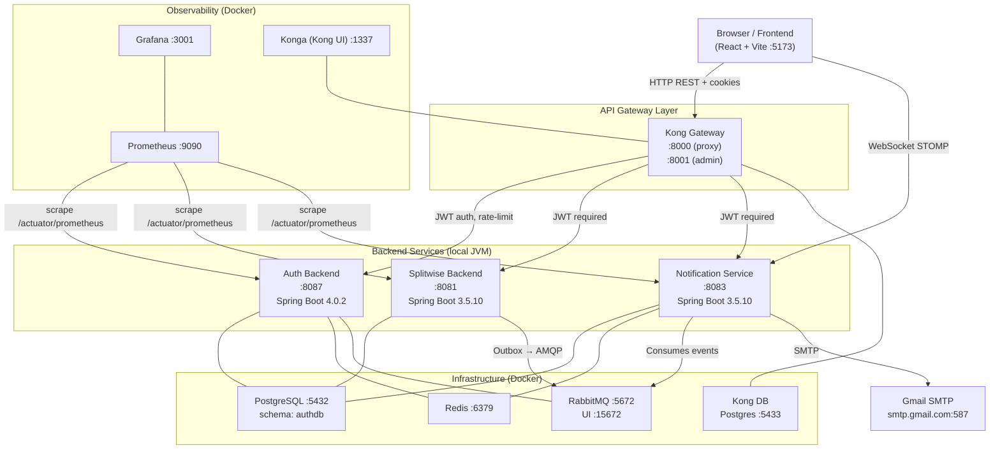

# SplitMoney — Developer Setup Guide

## Architecture



### Event Flow

```
User adds expense
  └─► Splitwise Backend
        └─► writes to notification_outbox (same DB transaction)
              └─► OutboxPublisher polls every 3s
                    └─► publishes to RabbitMQ (splitwise.events exchange)
                          └─► Notification Service consumes
                                ├─► saves in-app notification to DB
                                ├─► pushes via WebSocket (STOMP) to browser
                                └─► sends email via Gmail SMTP
```

---

## Prerequisites

| Tool | Min Version | Install |
|------|-------------|---------|
| Java JDK | 21 | `brew install --cask temurin@21` or [Adoptium](https://adoptium.net) |
| Maven | 3.9+ | `brew install maven` |
| Node.js | 18+ | `brew install node` or [nvm](https://github.com/nvm-sh/nvm) |
| npm | 9+ | Bundled with Node |
| Docker Desktop | latest | [docker.com/products/docker-desktop](https://www.docker.com/products/docker-desktop) |
| openssl | any | Pre-installed on macOS/Linux |

Verify:
```bash
java -version       # openjdk 21
mvn -version        # Apache Maven 3.9+
node -version       # v18+
docker info         # Docker running
```

---

## Step 1 — Configure Environment

### 1a. Copy the template

```bash
cp .env.example .env
```

### 1b. Fill in required secrets

Open `.env` and fill in every blank value. The sections below tell you where to get each secret.

**Run the validator at any time to check completeness:**
```bash
bash scripts/validate-env.sh
```

---

## Step 2 — Obtain External Credentials

### 2a. Google OAuth 2.0

You need a Google Cloud OAuth 2.0 client to enable Google Sign-In.

1. Go to [Google Cloud Console → APIs & Services → Credentials](https://console.cloud.google.com/apis/credentials)
2. Click **Create Credentials → OAuth client ID**
3. Application type: **Web application**
4. Add the following under **Authorised JavaScript origins**:
   ```
   http://localhost:5173
   ```
5. Add the following under **Authorised redirect URIs**:
   ```
   http://localhost:5173
   ```
6. Click **Create**. Copy the **Client ID** and **Client Secret**.
7. In `.env`:
   ```dotenv
   GOOGLE_OAUTH_CLIENT_ID=<your-client-id>.apps.googleusercontent.com
   GOOGLE_OAUTH_CLIENT_SECRET=<your-client-secret>
   VITE_GOOGLE_CLIENT_ID=<your-client-id>.apps.googleusercontent.com
   ```

### 2b. Gmail App Password (for email notifications)

> If you don't need email notifications in local dev, you can set `email-enabled: false`
> in `notification/src/main/resources/application.yaml` and skip this step.

1. Enable 2-Step Verification on your Google account
2. Go to [Google Account → Security → App Passwords](https://myaccount.google.com/apppasswords)
3. Select app: **Mail**, device: **Other (custom name)** → name it "SplitMoney Dev"
4. Copy the 16-character app password
5. In `.env`:
   ```dotenv
   MAIL_USERNAME=your-gmail@gmail.com
   MAIL_PASSWORD=xxxx xxxx xxxx xxxx
   MAIL_FROM=your-gmail@gmail.com
   ```

### 2c. PostgreSQL password

The PostgreSQL container in docker-compose uses your host machine's existing Postgres installation (or you can add a Postgres container). Set:
```dotenv
AUTH_DB_PASSWORD=<your-postgres-password>
SPLITWISE_DB_PASSWORD=<your-postgres-password>
NOTIFICATION_DB_PASSWORD=<your-postgres-password>
```
All three services currently share the same Postgres instance and `authdb` schema.

---

## Step 3 — Generate JWT Keys

The Auth Backend signs JWTs with an RSA-2048 private key. **Never commit these files.**

```bash
# Create key directory
mkdir -p AuthNAndAuthZ/auth-backend/keys

# Generate private key
openssl genpkey -algorithm RSA \
  -out AuthNAndAuthZ/auth-backend/keys/jwt-private.pem \
  -pkeyopt rsa_keygen_bits:2048

# Derive public key
openssl rsa -pubout \
  -in  AuthNAndAuthZ/auth-backend/keys/jwt-private.pem \
  -out AuthNAndAuthZ/auth-backend/keys/jwt-public.pem

# Copy public key to services that verify JWTs
cp AuthNAndAuthZ/auth-backend/keys/jwt-public.pem \
   splitewise-backend/src/main/resources/keys/jwt-public.pem

cp AuthNAndAuthZ/auth-backend/keys/jwt-public.pem \
   notification/src/main/resources/keys/jwt-public.pem
```

### Register the public key in Kong

After generating, copy the public key contents into `kong/kong.yml` under the
`consumers[0].jwt_secrets[0].rsa_public_key` field, replacing the existing key:

```bash
# Print the public key to copy:
cat AuthNAndAuthZ/auth-backend/keys/jwt-public.pem
```

Open `kong/kong.yml`, find the `rsa_public_key:` block near the bottom, and paste
the new public key content (keep the `|` YAML block scalar and indentation intact).

---

## Step 4 — Start Infrastructure (Docker)

### First run (initialise Kong DB and load config)

```bash
# Load .env into shell
set -a && source .env && set +a

# Start infra + run Kong migrations + import Kong config
docker compose --profile init up -d

# Verify all containers are healthy
docker compose ps
```

Expected healthy containers:

| Container | Port(s) |
|-----------|---------|
| splitwise-redis | 6379 |
| splitwise-rabbitmq | 5672, 15672 |
| kong-db | 5433 |
| kong-gateway | 8000, 8001, 8100 |
| kong-ui (Konga) | 1337 |
| splitwise-prometheus | 9090 |
| splitwise-grafana | 3001 |

### Subsequent runs (skip init)

```bash
docker compose up -d
```

### Tear down

```bash
docker compose down          # stop, keep volumes
docker compose down -v       # stop + wipe all volumes (full reset)
```

---

## Step 5 — Start Backend Services

Services must start in this order due to dependencies:

```
PostgreSQL  →  Auth Backend  →  Splitwise Backend
                            →  Notification Service
```

RabbitMQ must be running before Splitwise Backend and Notification Service.

### 5a. Auth Backend

**Directory:** `AuthNAndAuthZ/auth-backend/`

**Required env vars (set in your IDE run config or shell):**
```
AUTH_DB_URL, AUTH_DB_USERNAME, AUTH_DB_PASSWORD
RABBITMQ_HOST=localhost, RABBITMQ_PORT=5672
RABBITMQ_USERNAME, RABBITMQ_PASSWORD
GOOGLE_OAUTH_CLIENT_ID, GOOGLE_OAUTH_CLIENT_SECRET
```

**Shell:**
```bash
cd AuthNAndAuthZ/auth-backend
set -a && source ../../.env && set +a
./mvnw spring-boot:run
```

**IntelliJ Run Configuration:**
- Main class: `com.javaproject.application.AuthBackendApplication`
- Working directory: `$MODULE_DIR$` (i.e. `AuthNAndAuthZ/auth-backend/`)
- Environment variables: paste from `.env` (use the EnvFile plugin or add individually)
- JVM args: `-Dspring.profiles.active=default`

Verify: `curl http://localhost:8087/actuator/health` → `{"status":"UP"}`

---

### 5b. Splitwise Backend

**Directory:** `splitewise-backend/`  _(note: directory has a typo — one `e` extra)_

**Required env vars:**
```
SPLITWISE_DB_URL, SPLITWISE_DB_USERNAME, SPLITWISE_DB_PASSWORD
RABBITMQ_HOST=localhost, RABBITMQ_PORT=5672
RABBITMQ_USERNAME, RABBITMQ_PASSWORD
APP_JWT_PUBLIC_KEY_PATH=keys/jwt-public.pem
APP_JWT_ISSUER=auth-backend
```

**Shell:**
```bash
cd splitewise-backend
set -a && source ../.env && set +a
./mvnw spring-boot:run
```

**IntelliJ Run Configuration:**
- Main class: `com.javaproject.splitewise.SplitwiseBackendApplication` _(verify exact class name)_
- Working directory: `$MODULE_DIR$`
- Environment variables: paste from `.env`

Verify: `curl http://localhost:8081/actuator/health` → `{"status":"UP"}`

---

### 5c. Notification Service

**Directory:** `notification/`

**Required env vars:**
```
DB_URL=${NOTIFICATION_DB_URL}
DB_USERNAME=${NOTIFICATION_DB_USERNAME}
DB_PASSWORD=${NOTIFICATION_DB_PASSWORD}
MAIL_USERNAME, MAIL_PASSWORD, MAIL_FROM
RABBITMQ_HOST=localhost, RABBITMQ_PORT=5672
RABBITMQ_USERNAME, RABBITMQ_PASSWORD
REDIS_HOST=localhost, REDIS_PORT=6379
APP_JWT_PUBLIC_KEY_PATH=keys/jwt-public.pem
APP_JWT_ISSUER=auth-backend
```

**Shell:**
```bash
cd notification
set -a && source ../.env && set +a
# Pass notification-specific DB vars
export DB_URL=$NOTIFICATION_DB_URL
export DB_USERNAME=$NOTIFICATION_DB_USERNAME
export DB_PASSWORD=$NOTIFICATION_DB_PASSWORD
./mvnw spring-boot:run
```

**IntelliJ Run Configuration:**
- Main class: _(verify in `notification/src/main/java/`)_
- Working directory: `$MODULE_DIR$`
- Environment variables: add all of the above, plus `DB_URL`, `DB_USERNAME`, `DB_PASSWORD` mapped from NOTIFICATION_ vars

Verify: `curl http://localhost:8083/actuator/health` → `{"status":"UP"}`

---

## Step 6 — Start Frontend

```bash
cd frontend-splitmoney

# First time only
npm install

# Create frontend .env if not present
cat > .env.local << 'EOF'
VITE_GOOGLE_CLIENT_ID=<your-google-client-id>
VITE_GOOGLE_REDIRECT_URI=http://localhost:5173
EOF

npm run dev
```

Open [http://localhost:5173](http://localhost:5173)

---

## Service Reference

| Service | URL | Notes |
|---------|-----|-------|
| Frontend | http://localhost:5173 | Vite dev server |
| Kong Proxy (API) | http://localhost:8000 | All API calls go here |
| Kong Admin | http://localhost:8001 | Kong REST admin API |
| Konga (Kong UI) | http://localhost:1337 | Visual admin for Kong |
| Auth Backend | http://localhost:8087 | Direct (bypasses Kong) |
| Splitwise Backend | http://localhost:8081 | Direct (bypasses Kong) |
| Notification Service | http://localhost:8083 | Direct (bypasses Kong) |
| RabbitMQ Management | http://localhost:15672 | `guest` / `guest` (dev) |
| Prometheus | http://localhost:9090 | Metrics |
| Grafana | http://localhost:3001 | Dashboards — admin / `$GRAFANA_ADMIN_PASSWORD` |

### Kong-proxied API routes

| Route | Service | Auth |
|-------|---------|------|
| `POST /api/auth/v1/register` | Auth | Public |
| `POST /api/auth/v1/login` | Auth | Public |
| `POST /api/auth/v1/login/google` | Auth | Public |
| `POST /api/auth/v1/forgot-password` | Auth | Public |
| `POST /api/auth/v1/reset-password` | Auth | Public |
| `GET  /api/auth/*` | Auth | JWT cookie required |
| `*    /api/splitwise/*` | Splitwise | JWT cookie required |
| `POST /api/v1/expenses` | Splitwise | JWT cookie required |
| `*    /api/notifications*` | Notification | JWT cookie required |

---

## Troubleshooting

### "Connection refused" on startup

Ensure Docker containers are healthy before starting JVM services:
```bash
docker compose ps
# All containers should show "healthy" or "running"
```

### Auth backend fails to start — "FileNotFoundException: keys/jwt-private.pem"

The JWT keys are not committed. Generate them following Step 3.

### "GOOGLE_OAUTH_CLIENT_ID must not be null"

The env var is not set. Make sure you sourced `.env` in your shell or added it to
your IDE run configuration.

### RabbitMQ consumer not connecting

Check that `RABBITMQ_HOST=localhost` (not `rabbitmq`) when running services locally
outside Docker. The `rabbitmq` hostname is only valid inside the Docker network.

### Flyway migration baseline error (Notification service)

If you see a Flyway checksum or baseline error on a fresh database:
```bash
# Connect to Postgres and drop the flyway schema history
psql -h localhost -U postgres -d postgres -c \
  "DELETE FROM authdb.flyway_schema_history WHERE success = false;"
```
Then restart the notification service.

### Kong JWT "Invalid Signature" after regenerating keys

After rotating JWT keys, the Kong consumer's `rsa_public_key` must be updated.
Re-import the Kong config:
```bash
docker compose --profile init run --rm kong-config
```

### WebSocket (STOMP) not connecting

Ensure the Notification service is running on `:8083` and that the frontend
`VITE_` env vars are set correctly. STOMP connects directly to the service,
not through Kong.

---

## Environment Variables Quick Reference

| Variable | Used By | Where to get |
|----------|---------|--------------|
| `AUTH_DB_PASSWORD` | Auth Backend | Your local Postgres password |
| `SPLITWISE_DB_PASSWORD` | Splitwise Backend | Your local Postgres password |
| `NOTIFICATION_DB_PASSWORD` | Notification | Your local Postgres password |
| `RABBITMQ_USERNAME` / `PASSWORD` | All backends | `guest`/`guest` for local Docker |
| `GOOGLE_OAUTH_CLIENT_ID` | Auth Backend, Frontend | Google Cloud Console |
| `GOOGLE_OAUTH_CLIENT_SECRET` | Auth Backend | Google Cloud Console |
| `VITE_GOOGLE_CLIENT_ID` | Frontend | Same as `GOOGLE_OAUTH_CLIENT_ID` |
| `MAIL_USERNAME` | Notification | Your Gmail address |
| `MAIL_PASSWORD` | Notification | Gmail App Password (16 chars) |
| `KONG_DB_PASSWORD` | Docker / Kong | Any string for local dev |
| `GRAFANA_ADMIN_PASSWORD` | Docker / Grafana | Any string for local dev |
